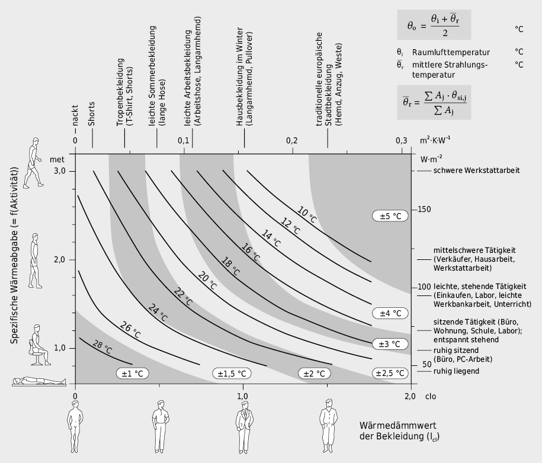

# h,x-Diagramm für feuchte Luft

[](LICENSE)
[](https://git.logicc.ch/hx-diagramm/)

Interaktive Web-App zur Darstellung eines Mollier h,x-Diagramms für feuchte Luft. Läuft vollständig im Browser; kein Backend erforderlich.


## Funktionsumfang

- **Psychrometrisch korrekt:** Sättigungsdampfdruck nach Magnus-Formel, Luftdruck nach ICAO-Standardatmosphäre
- **Konfigurierbar:** Temperaturbereich, Feuchtebereich und Höhe über Meer frei wählbar
- **Interaktive Zustandspunkte:** Per Klick setzen, per Drag & Drop verschieben oder numerisch eingeben; zwischen aufeinanderfolgenden Punkten werden Prozesslinien gezeichnet
- **Vollständige Zustandsberechnung:** Temperatur, relative und absolute Feuchte, Enthalpie, Taupunkt und Dichte
- **Leistungsberechnung:** Massen- oder Volumenstrom eingeben; die App berechnet Heiz-/Kühlleistung und Be-/Entfeuchtung je Prozessabschnitt samt Gesamtbilanz
- **Behaglichkeits-Overlays:** Drei unabhängig zuschaltbare Darstellungen – das historische Leusden/Freymark-Feld, die Schwülegrenze bei x = 11,5 g/kg und die normbasierten PMV-Kategorien nach EN ISO 7730
- **Design nach Seven-Air-Vorlage:** Monochromes Liniennetz, Helvetica-Beschriftung, alle Linien bis zum Diagrammrand
- **Responsive:** Unterhalb 900 px Breite gestapeltes, scrollbares Layout mit dem Diagramm zuoberst; Zustandspunkte sind per Touch setz- und verschiebbar

Dargestellt werden die Sättigungslinie (φ = 100 %), die Linien relativer Feuchte (φ = 10 %, 20 %, … 90 %), diagonale Enthalpielinien h (kJ/kg), horizontale Isothermen T (°C) und vertikale Linien konstanter absoluter Feuchte x (g/kg).

## Installation

```bash
git clone https://github.com/Raffa3l/hx-diagramm.git
cd hx-diagramm
npm install
npm run dev
```

Die App ist dann unter `http://localhost:5173/hx-diagramm/` erreichbar (Basispfad aus `vite.config.js`). Für den Produktionsbuild `npm run build` (Ausgabe nach `dist/`, auf jedem statischen Webserver hostbar) und `npm run preview` zum lokalen Testen.

## Bedienung

Alle Eingaben liegen in der Seitenleiste in fünf einklappbaren Panels; ein Klick auf die Überschrift öffnet und schliesst sie.

### Diagramm konfigurieren

| Parameter | Standardwert | Beschreibung |
|---|---|---|
| Höhe ü. M. | 500 m | bestimmt den barometrischen Luftdruck nach ICAO-Standardatmosphäre |
| T min | −10 °C | untere Grenze der Temperaturachse |
| T max | 50 °C | obere Grenze der Temperaturachse |
| x max | 30 g/kg | obere Grenze der absoluten Feuchte |

Die Höhe über Meer beeinflusst den Luftdruck und damit alle psychrometrischen Berechnungen – Sättigungslinie, Enthalpie und Taupunkt verschieben sich mit. Änderungen in diesem Panel wirken erst nach „Diagramm aktualisieren".

### Zustandspunkte

Punkte lassen sich per Klick ins Diagramm setzen oder numerisch eingeben (Temperatur plus relative Feuchte φ oder absolute Feuchte x). Jeder Punkt zeigt T (°C), φ (%), x (g/kg), h (kJ/kg), Taupunkt T_d (°C) und Dichte ρ (kg/m³). Punkte ausserhalb des dargestellten Bereichs werden abgelehnt, damit keine unsichtbaren Punkte in Prozesslinie und Leistungsberechnung einfliessen.

### Luftstrom & Leistung

Eingegeben wird ein Massenstrom (kg/s, kg/h) oder ein Volumenstrom (m³/s, m³/h). Für jeden Prozessabschnitt Pᵢ → Pᵢ₊₁ berechnet die App:

| Grösse | Formel | Einheit |
|---|---|---|
| Heiz-/Kühlleistung | `Q = ṁ · Δh` | kW |
| Be-/Entfeuchtungsleistung | `ṁ_W = ṁ · Δx` | kg/h |

Ab drei Punkten kommt die Gesamtbilanz über die ganze Prozesskette hinzu, aufgeteilt in vier Summen: **Heizleistung**, **Kühlleistung**, **Befeuchtung** und **Entfeuchtung**. Bewusst nicht saldiert – Heizen und Kühlen bzw. Be- und Entfeuchten heben sich in einer Anlage nicht auf, sondern brauchen je eigene Erzeuger. Die Summe der Beträge je Wirkrichtung ist die auslegungsrelevante Grösse, nicht die Differenz.

**Konventionen:** Der Massenstrom ṁ ist auf trockene Luft bezogen (h und x sind pro kg trockene Luft definiert). Ein eingegebener Volumenstrom wird je Abschnitt mit Dichte und Feuchte am Abschnittsanfang umgerechnet: `ṁ = V̇ · ρ / (1 + x)`.

### Behaglichkeits-Overlays

Im Panel „Behaglichkeit" lassen sich drei Darstellungen unabhängig voneinander zuschalten; sie wirken sofort, ohne „Diagramm aktualisieren".

| Checkbox | Zeigt | Grundlage |
|---|---|---|
| Behaglichkeitszonen anzeigen | zwei Komfortzonen („behaglich" / „noch behaglich") | Leusden/Freymark-Feld, historisch |
| Schwülegrenze anzeigen | senkrechte Linie bei x = 11,5 g/kg | BAuA, ASR A3.5 |
| PMV-Kategorien anzeigen | drei Bänder um den thermisch neutralen Zustand | EN ISO 7730 / SN EN 16798-1 |

Die PMV-Zonen hängen von vier Parametern ab, die direkt darunter eingestellt werden:

| Parameter | Standardwert | Beschreibung |
|---|---|---|
| Bekleidung | 0,5 clo | leichte Sommerbekleidung; 1,0 clo entspricht Winterbekleidung |
| Aktivität | 1,2 met | sitzende, entspannte Tätigkeit |
| Luftgeschwindigkeit | 0,1 m/s | relative Luftgeschwindigkeit (ruhende Luft) |
| Strahlungstemp. t_r | = T-Achse | leer bedeutet: t_r folgt der Lufttemperatur der Y-Achse |

Weil das Ergebnis vollständig von diesen vier Grössen abhängt, werden sie im Diagramm unter der Zonenbeschriftung mitgeführt. Die Eingabe ist um 400 ms entprellt – siehe [Strahlungstemperatur t_r](#strahlungstemperatur-t_r).

## Fachliche Einordnung

Die drei Overlays beruhen auf unterschiedlich belastbaren Grundlagen. Kurz gefasst: Leusden/Freymark und die Schwülegrenze sind **historische bzw. vereinfachende Orientierungskonzepte**, die PMV-Kategorien sind **normbasiert**. Keines der Overlays ersetzt einen normkonformen Behaglichkeitsnachweis.

### Leusden/Freymark-Feld

| Zone | Darstellung | Eckpunkte (T in °C / φ in %) |
|---|---|---|
| behaglich | gelbgrün, 40 % Deckkraft | (19/38), (17.5/74), (22.5/65), (24/35) |
| noch behaglich | orange, 25 % Deckkraft | (20/20), (17/40), (16/75), (17/85), (21.5/80), (25/60), (27/30), (25.5/20) |

**Quellenlage.** Die Zonen-Eckpunkte stammen aus der [HSLU-edar-Referenz `comfortTempHum.Rmd`](https://github.com/hslu-ige-laes/edar/blob/master/partDataVis/comfortTempHum.Rmd) (dort in einem T/φ-Plot; die Kanten werden hier linear in (T, φ) abgetastet und über φ→x ins h,x-System transformiert, wodurch die Zonenform druckabhängig wird). Form, Zweiteilung und Terminologie entsprechen erkennbar dem historisch etablierten Leusden/Freymark-Feld:

> Leusden, F. v.; Freymark, H.: *Darstellung der Raumbehaglichkeit für den praktischen Gebrauch.* Gesundheits-Ingenieur 72 (1951), Heft 16, S. 271–273.

Diese Originalpublikation ist nicht frei verfügbar; die **exakten Eckpunkte konnten daher nicht Ziffer für Ziffer gegen das Original verifiziert werden** – nur Form und Grössenordnung sind plausibilisiert (Wikipedia nennt für Behaglichkeit allgemein 18–24 °C / 35–75 % rF / x 5–12 g/kg, was sich mit der inneren Zone von 19–24 °C / 35–74 % rF deckt, ohne Leusden/Freymark namentlich zu nennen oder zwei Zonen zu unterscheiden).

### Schwülegrenze (x = 11,5 g/kg)

Die **Schwülegrenze** bei x = 11,5 g/kg wird als senkrechte, gestrichelte Linie gezeichnet; rechts davon wird die Luft als schwül empfunden. Sie gilt nur für ungesättigte Luft und endet unten an der Sättigungslinie, also am druckabhängigen Taupunkt von 11,5 g/kg (bei 955 mbar ≈ 15,3 °C); darunter beginnt das Nebelgebiet. Bei x max < 11,5 g/kg liegt sie ausserhalb und wird nicht gezeichnet.

**Quellenlage.** Der feste Wert x = 11,5 g/kg stützt sich auf die deutsche Arbeitsschutzliteratur (BAuA, ASR A3.5) und ist nach Schweizer Fachnormung als vereinfachendes Konzept zu betrachten, nicht als normkonformer Referenzwert. Massgeblich sind heute EN ISO 7730 und ASHRAE 55, die methodisch grundlegend anders arbeiten (PMV/PPD nach Fanger unter Einbezug von Bekleidung, Aktivität, Luftgeschwindigkeit und Strahlungstemperatur; ASHRAE 55 zusätzlich mit adaptivem Komfortmodell). Für Schweizer Projekte unmittelbar anwendbar ist SN EN 16798-1 mit nationalem Anhang SIA 382.711, die sich für das Schwüleempfinden auf den vorausgesagten Prozentsatz der thermischen Akzeptanz (PTA) stützt und unter Berufung auf Kleber et al. (2018) explizit festhält, dass **keine feste, temperaturunabhängige Schwülegrenze existiert**. Keine dieser Normen definiert eine einfache T/x-Zone im Mollier-Diagramm.

### PMV nach EN ISO 7730

Anders als das Leusden/Freymark-Feld sind die PMV-Zonen **keine festen Eckpunkte**, sondern Höhenlinien des PMV-Felds: Für jeden Gitterpunkt (T, x) wird der PMV nach dem Iterationsverfahren aus EN ISO 7730 Anhang D berechnet und anschliessend konturiert. Ein Band |PMV| ≤ Grenzwert entsteht aus den beiden Konturen −Grenzwert und +Grenzwert, per `fill-rule="evenodd"` zu einem Ring kombiniert.

| Kategorie (SN EN 16798-1) | Bedingung | PPD |
|---|---|---|
| I | \|PMV\| ≤ 0,2 | < 6 % |
| II | \|PMV\| ≤ 0,5 | < 10 % |
| III | \|PMV\| ≤ 0,7 | < 15 % |

Das Band verläuft **nahezu waagrecht mit leichtem Gefälle nach rechts**: Bei 0,5 clo und 1,2 met liegt die Neutraltemperatur (PMV = 0) bei x = 2 g/kg um 25,7 °C und bei x = 14 g/kg um 24,3 °C – über 12 g/kg Feuchteänderung also nur rund 1,4 K. Der Feuchteeinfluss ist damit deutlich schwächer als der Temperatureinfluss. Genau darin liegt der Unterschied zur senkrechten Schwülegrenze: Blendet man beide Overlays gleichzeitig ein, kreuzen sie sich fast rechtwinklig. Das macht sichtbar, warum ein fester, temperaturunabhängiger x-Grenzwert nicht dem heutigen Normenverständnis entspricht.

Im Nebelgebiet ist PMV nicht definiert; die Zonen werden deshalb an der Sättigungslinie abgeschnitten.

**Verifikation.** Die Implementierung ist gegen die Referenzfälle aus EN ISO 7730 Tabelle D.1 geprüft (grösste Abweichung 0,007 PMV). Als unabhängige Gegenprobe dient das Nomogramm aus dem Lehrmittel [enbau-online.ch, Bauphysik – Kapitel 1.2 „Innenklima und Komfort"](https://enbau-online.ch/bauphysik/1-2-innenklima-und-komfort/):



> **Abbildung:** Optimale operative Temperatur θ_o nach EN ISO 7730 in Abhängigkeit von **Aktivität** (Ordinate, in der App das Feld „Aktivität (met)") und **Bekleidung** (Abszisse, in der App das Feld „Bekleidung (clo)"); mittlere relative Luftfeuchte ca. 50 %. Die Toleranzbänder wachsen von ±1 °C links unten (leicht bekleidet, ruhig sitzend) auf ±5 °C rechts oben (warm bekleidet, schwere Arbeit) – je höher Aktivität und Bekleidung, desto breiter das behagliche Temperaturfenster.
>
> *Quelle: enbau-online.ch, Bauphysik, Kap. 1.2, Abbildung 1.22 (nach EN ISO 7730), abgerufen am 23.07.2026. Bildzitat mit Quellenangabe.*

Die Abbildung verwendet die Formelzeichen der Norm; in der App heissen dieselben Grössen so:

| in der Abbildung | in der App |
|---|---|
| Spezifische Wärmeabgabe = f(Aktivität), *M* in met bzw. W·m⁻² | **Aktivität (met)** – nur der met-Wert, nicht W·m⁻² |
| Wärmedämmwert der Bekleidung *I*_cl in clo bzw. m²·K·W⁻¹ | **Bekleidung (clo)** – nur der clo-Wert |
| θ_i Raumlufttemperatur | **T-Achse des Diagramms** |
| θ_r mittlere Strahlungstemperatur | **Strahlungstemp. t_r (°C)**, leer = folgt der T-Achse |
| θ_o optimale operative Temperatur | Ergebnisgrösse, keine Eingabe: die Lage der PMV-Bänder |

Abgelesen auf der Höhe 1,2 met liefert das Nomogramm bei 1,0 clo die 22-°C-Isolinie und bei 0,5 clo einen Wert zwischen den Isolinien 24 °C und 26 °C. Unter derselben Bedingung (50 % rF, wie im Nomogramm unterstellt) rechnet `psy.pmv()` 21,6 °C bzw. 24,7 °C – beides innerhalb der Ablesegenauigkeit.

Die Abbildung fasst Luft- und Strahlungstemperatur zur operativen Temperatur θ_o = (θ_i + θ_r)/2 zusammen. Die App rechnet nicht mit dieser Mittelwertnäherung, sondern mit dem vollständigen Verfahren aus Anhang D, in dem der Strahlungsaustausch über die Bekleidungsoberflächentemperatur eingeht – im Ergebnis mit praktisch demselben Gewicht (siehe unten). Und sie zeigt nur die *optimale* Temperatur (PMV = 0), während die App die Bänder darum herum darstellt.

#### Strahlungstemperatur t_r

**Die PMV-Zonen werden für jeden Punkt des Diagramms berechnet, nicht für einen gesetzten Zustandspunkt.** Zustandspunkte gehen nicht ein – löscht man sie, bleiben die Zonen unverändert.

Ein leeres t_r-Feld bedeutet deshalb *nicht* „t_r = Temperatur meines Punktes", sondern: t_r folgt der Y-Achse und wird für jede Diagrammzeile neu gesetzt (Zeile 16 °C → t_r = 16 °C, Zeile 30 °C → t_r = 30 °C). Ein fester Wert von z. B. 20 °C gilt dagegen im ganzen Diagramm. Beide Einstellungen stimmen nur in der einen Zeile T = 20 °C überein – und dort liegt in der Regel gerade keine Zonengrenze:

| Zeile T | leer: t_r / PMV | t_r = 20 °C: t_r / PMV |
|---|---|---|
| 20 °C | 20 °C / −0,46 | 20 °C / −0,46 ← nur hier gleich |
| 24 °C | 24 °C / +0,38 | 20 °C / −0,05 |
| 30 °C | 30 °C / +1,64 | 20 °C / +0,47 |

(clo 2, met 0,8, v 0 m/s, x = 7,71 g/kg)

Ein fest vorgegebenes t_r **verbreitert** das Band zusätzlich: Bei t_r = T ändern sich Luft- und Strahlungstemperatur pro Achsenschritt gemeinsam, bei festem t_r nur die Luft – die Empfindlichkeit dPMV/dT halbiert sich, das Band wird rund doppelt so breit. Im Beispiel oben misst Kategorie II 4,8 K bei gekoppeltem t_r und 10,6 K bei festem, also Faktor 2,2; bei v = 0,1 m/s statt 0 sind es 9,6 K und damit Faktor 2,0 – ohne erzwungene Konvektion überwiegt der Strahlungsanteil etwas stärker.

t_r geht damit **etwa gleich stark in den PMV ein wie die Lufttemperatur** – das ist der Operativtemperatur-Effekt. Gemessen an der Implementierung verschiebt sich die Neutraltemperatur um rund 1 K je K t_r (0,5 clo, 1,2 met, 0,1 m/s, x = 7,71 g/kg):

| t_r | 2 °C | 20 °C | 25 °C | 30 °C |
|---|---|---|---|---|
| Neutraltemperatur | 43,9 °C | 30,2 °C | 25,1 °C | 20,6 °C |

Ein niedrig eingestelltes t_r schiebt die Zonen also weit nach oben. Das ist physikalisch korrekt, sieht aber nach einem Fehler aus – die Eingabe ist deshalb um 400 ms entprellt, damit Zwischenstände beim Tippen (die „2" auf dem Weg zu „20") nicht gerendert werden.

## Physikalische Grundlagen

Formeln und Konstanten nach VDI 4670 Blatt 1 bzw. ASHRAE Fundamentals; Sättigungsdampfdruck nach Magnus mit Tetens-Koeffizienten (vgl. VDI 3786 Blatt 4).

- **Sättigungsdampfdruck**: Magnus-Formel (getrennte Koeffizienten für T ≥ 0 °C über Wasser und T < 0 °C über Eis)
- **Barometrischer Druck**: ICAO-Standardatmosphäre: `p = 101325 · (1 − 2.25577·10⁻⁵ · H)^5.25588`
- **Enthalpie (ungesättigt)**: `h = 1.006·T + x·(2501 + 1.86·T)` in kJ/kg trockene Luft
- **Enthalpie (Nebelgebiet, x > x_s)**: `h = 1.006·T + x_s·(2501 + 1.86·T) + (x − x_s)·4.19·T`; nur x_s ist dampfförmig, der Rest flüssig
- **Absolute Feuchte**: `x = 0.622 · pD / (p − pD)` in kg/kg
- **Dichte feuchter Luft**: `ρ = p/(R_d·T_abs) · (1 + x)/(1 + 1.608·x_Dampf)`; im Nebelgebiet mit `x_Dampf = x_s`
- **PMV/PPD**: Iterationsverfahren nach EN ISO 7730 Anhang D (Fixpunktiteration für die Bekleidungsoberflächentemperatur, danach Wärmebilanz aus Diffusion, Schwitzen, Atmung, Strahlung und Konvektion)

Übersättigte Zustandspunkte (im Nebelgebiet) werden mit φ = 100 %, T_d = T gerechnet und in Punktkarte und Tooltip als **„Nebelgebiet (übersättigt)"** gekennzeichnet.

**Bekannte Vereinfachung:** Die gezeichneten Enthalpielinien laufen im Nebelgebiet mit der ungesättigten Formel gerade weiter (wie in der Seven-Air-Vorlage), statt an der Sättigungslinie abzuknicken. Zum Ablesen von h im Nebelgebiet daher die Punktkarten bzw. den Tooltip verwenden; diese rechnen dort korrekt mit dem Flüssigwasserterm.

## Technik & Quellen

- [Vite](https://vitejs.dev/) als Build-Tool und Entwicklungsserver, [D3.js](https://d3js.org/) v7 für SVG-Rendering und Interaktion, sonst Vanilla JavaScript (ES Modules) ohne Framework
- Visuelles Layout orientiert sich am h,x-Diagramm der [Seven-Air Gebr. Meyer AG](https://www.seven-air.ch/resources/h-x-Diagramm-540.pdf)
- Psychrometrische Referenz: [d3-mollierhx](https://github.com/hslu-ige-laes/d3-mollierhx) (HSLU)
- Einordnung von Behaglichkeit und Innenklima: [enbau-online.ch, Bauphysik – Kap. 1.2](https://enbau-online.ch/bauphysik/1-2-innenklima-und-komfort/); von dort stammt auch die als Bildzitat wiedergegebene Abbildung 1.22 in `docs/`

## Lizenz

MIT
