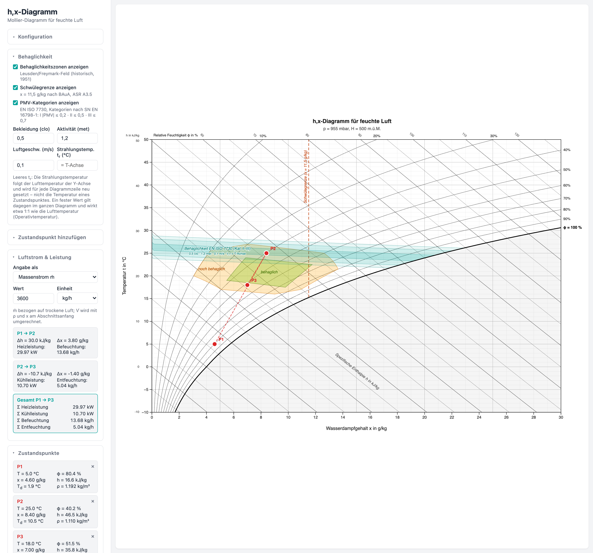

# h,x-Diagramm für feuchte Luft

[](LICENSE)
[](https://raffa3l.github.io/hx-diagramm/)

Interaktive Web-App zur Darstellung eines Mollier h,x-Diagramms für feuchte Luft. Läuft vollständig im Browser – kein Backend erforderlich.



[Live-Demo](https://raffa3l.github.io/hx-diagramm/)

## Features

- **Psychrometrisch korrekt** – Sättigungsdampfdruck nach Magnus-Formel, Luftdruck nach ICAO-Standardatmosphäre
- **Konfigurierbar** – Temperaturbereich, Feuchtebereich und Höhe über Meer frei wählbar
- **Interaktive Zustandspunkte** – Per Klick ins Diagramm setzen, per Drag & Drop verschieben oder numerisch eingeben
- **Prozesslinien** – Automatische Verbindung zwischen Zustandspunkten
- **Vollständige Zustandsberechnung** – Temperatur, relative/absolute Feuchte, Enthalpie, Taupunkt und Dichte

### Dargestellte Grössen

| Element | Beschreibung |
|---|---|
| Sättigungslinie | φ = 100 % |
| Relative Feuchte | φ = 10 %, 20 %, … 90 % |
| Enthalpielinien | Diagonale Linien konstanter Enthalpie h (kJ/kg) |
| Isothermen | Horizontale Linien konstanter Temperatur T (°C) |
| Linien konstanter Feuchte | Vertikale Linien konstanter absoluter Feuchte x (g/kg) |

## Installation

```bash
git clone https://github.com/raffa3l/hx-diagramm.git
cd hx-diagramm
npm install
npm run dev
```

Die App ist dann unter `http://localhost:5173` erreichbar.

### Produktionsbuild

```bash
npm run build
npm run preview
```

Der Build wird im Ordner `dist/` abgelegt und kann auf jedem statischen Webserver gehostet werden.

## Konfigurationsparameter

| Parameter | Standardwert | Beschreibung |
|---|---|---|
| Höhe ü. M. | 500 m | Höhe über Meer – bestimmt den barometrischen Luftdruck nach ICAO-Standardatmosphäre |
| T min | −10 °C | Untere Grenze der Temperaturachse |
| T max | 50 °C | Obere Grenze der Temperaturachse |
| x max | 30 g/kg | Obere Grenze der absoluten Feuchte |

Die Höhe über Meer beeinflusst den Luftdruck und damit alle psychrometrischen Berechnungen (Sättigungslinien, Enthalpie, Taupunkt).

## Zustandspunkte

Zustandspunkte können auf zwei Arten erstellt werden:

1. **Klick ins Diagramm** – Punkt wird an der angeklickten Stelle gesetzt
2. **Numerische Eingabe** – Temperatur + relative Feuchte (φ) oder absolute Feuchte (x) eingeben

Jeder Zustandspunkt zeigt:
- Temperatur T (°C)
- Relative Feuchte φ (%)
- Absolute Feuchte x (g/kg)
- Spezifische Enthalpie h (kJ/kg)
- Taupunkttemperatur T_d (°C)
- Dichte ρ (kg/m³)

Punkte können per Drag & Drop verschoben werden. Zwischen aufeinanderfolgenden Punkten werden Prozesslinien gezeichnet.

## Physikalische Grundlagen

- **Sättigungsdampfdruck**: Magnus-Formel (getrennte Koeffizienten für T ≥ 0 °C und T < 0 °C über Eis)
- **Barometrischer Druck**: ICAO-Standardatmosphäre: `p = 101325 · (1 − 2.25577·10⁻⁵ · H)^5.25588`
- **Enthalpie**: `h = 1.006·T + x·(2501 + 1.86·T)` in kJ/kg trockene Luft
- **Absolute Feuchte**: `x = 0.622 · pD / (p − pD)` in kg/kg

## Tech-Stack

- [Vite](https://vitejs.dev/) – Build-Tool und Entwicklungsserver
- [D3.js](https://d3js.org/) v7 – SVG-Rendering und Interaktion
- Vanilla JavaScript (ES Modules) – kein Framework

## Inspiration

- Visuelles Layout orientiert sich am h,x-Diagramm der [Seven-Air Gebr. Meyer AG](https://www.seven-air.ch/resources/h-x-Diagramm-540.pdf)
- Psychrometrische Referenz: [d3-mollierhx](https://github.com/hslu-ige-laes/d3-mollierhx) (HSLU)

## Lizenz

MIT
